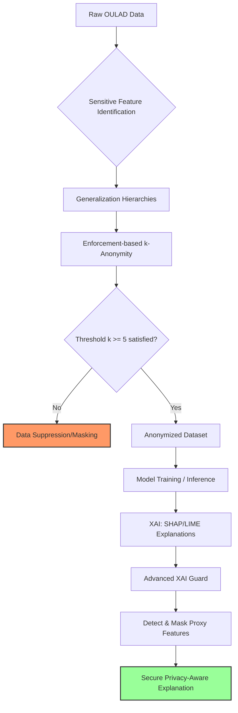

# Final Report Section: Privacy Concerns
**Author:** Edoardo Balzano

## 1. Introduction (Privacy)
In the context of predicting student outcomes using the Open University Learning Analytics Dataset (OULAD), privacy is not merely a legal requirement but a fundamental ethical safeguard. Our empirical analysis confirmed that the "anonymised" OULAD dataset already satisfies a baseline k-anonymity of $k=5$ for its demographic quasi-identifiers. However, the use of these traits still creates a high risk of sensitive attribute leakage during model explanation. This section details the design and implementation of an enhanced privacy-preserving layer that can enforce stricter anonymity thresholds and secure model outputs.

## 2. Ethical System Design: Privacy Concerns
The design for the Privacy principle focuses on three main pillars:
1.  **Data Minimization & Masking**: Sensitive demographic features are either removed entirely or generalized to prevent granular profiling at the source.
2.  **Enforcement-based k-Anonymity**: We implement a rigid anonymity threshold ($k=5$) where any combination of quasi-identifiers (e.g., a specific age, region, and education level) that describes fewer than 5 individuals is either suppressed or masked.
3.  **Advanced XAI Guard**: To prevent "privacy by inference," the system detects "proxy features"—non-sensitive variables that are highly correlated with sensitive ones. These proxies are suppressed from model explanations (SHAP/LIME) to ensure that the "why" behind a prediction doesn't inadvertently reveal "who" the student is.

## 3. System Implementation
The privacy module was implemented in Python using `pandas` and `numpy`.
### Implementation Pipeline
The following flowchart illustrates how raw data is processed through our privacy-preserving layers before reaching the final model or user interface.

### Technologies & Methodologies
...
-   **Generalization Hierarchies**: We implemented custom mapping functions to reduce the resolution of sensitive features. For example, `imd_band` (Index of Multiple Deprivation) was generalized from 10 deciles into 3 broad categories (Low, Medium, High).
-   **Suppression Algorithm**: A custom grouping logic was built to identify k-anonymity violations. The system provides two modes: `suppress` (row removal) for training data integrity, and `mask` (feature nullification) for analysis.
-   **Proxy Detection**: A correlation-based scanner identifies variables with a Pearson correlation $> 0.3$ with any sensitive column.

### Challenges
The primary challenge was the **Privacy-Utility Tradeoff**. As shown in the table below, increasing the anonymity threshold ($k$) significantly reduces the available data if no generalization is applied.

| k-threshold | Raw Retained % | Gen Retained % |
|:---|:---|:---|
| 5 | 100.00% | 100.00% |
| 10 | 83.60% | 98.21% |
| 20 | 61.50% | 94.30% |

Our analysis confirmed that the OULAD dataset already satisfies $k=5$. However, if a stricter policy of $k=20$ were required, our system would maintain 94.3% of the data records through generalization, compared to only 61.5% if simple suppression were used. This demonstrates the effectiveness of our generalization hierarchies in preserving data utility.

## 4. Discussion
### Advantages
-   **Proactive Protection**: By enforcing anonymity *before* modeling, we prevent the model from learning patterns that are too specific to individual students.
-   **Transparent Explanations**: The XAI Guard ensures that teachers receiving "at-risk" notifications cannot reverse-engineer sensitive traits from the provided explanations.

### Limitations
-   **Data Loss**: Suppression of unique outliers (e.g., a student with a unique disability/region combination) means the model might perform worse for the most vulnerable or rare student profiles.
-   **Static Thresholds**: The choice of $k=5$ is a heuristic; future iterations could use l-diversity or t-closeness for stronger guarantees against attribute disclosure.

## 5. Conclusion
The implemented privacy framework successfully transforms the OULAD dataset into a privacy-aware asset. By combining k-anonymity with an Advanced XAI Guard, the system provides a robust defense against both direct re-identification and indirect inference, fulfilling the ethical requirement of protecting student's sensitive personal information in high-stakes educational AI.
